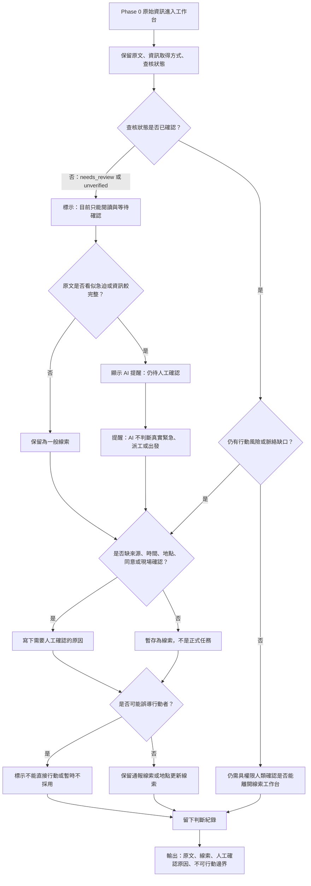

# 資訊流程設計

> 這份文件可以由 Codex 先產生草稿，但你必須用 VS Code 預覽 Mermaid，並由人檢查流程是否合理。

## 我的 v1 目標

- 我優先服務的使用者：行動者。
- 這個使用者最想完成的事：快速判斷目前資訊是否仍不能行動，以及自己應該停在哪裡。
- 我最想避免的錯誤：把未確認資訊、候選草稿或 AI 提醒誤當成已確認任務。

## 自然語言流程描述

```text
Phase 0 原始資訊進入工作台後，系統先保留原文、資訊取得方式與查核狀態。

行動者先看到這筆資訊目前仍不是正式任務，並檢查是否有未確認狀態、轉述來源、模糊位置、時間不足、當事人同意不足或現場狀態不明。

如果資訊仍是 needs_review 或 unverified，或含有轉述、來源不明、位置不清、同意不明、現場狀態不明，就標示為「目前只能閱讀與等待確認」，不能出發，也不能把它當成正式派工依據。

如果原文看似急迫或資訊較完整，可以標成 AI 提醒或線索，但 AI 不能決定真實緊急程度、是否派工、是否出發或是否進入正式任務。

資訊整理者可以把內容暫存成線索，例如通報線索或地點更新線索，但這些線索仍不是正式流程。

如果需要人工確認，必須留下為什麼需要確認，例如缺來源、缺時間、缺當事人同意、AI 有推測或原文互相矛盾。

如果資訊不足、可能誤導行動者，或缺少確認責任角色，流程必須停在「不能直接行動」或「暫時不採用」，並保留原因。

只有在具權限的人類確認來源、現場、當事人同意與是否能進入正式任務後，才可以離開這份 v1 線索工作台；本流程本身不產生正式派工。
```

## Mermaid 流程圖

請用 VS Code 預覽，確認流程圖能正常顯示。



## 人工確認點

- 是否能採取行動，不能由 AI 或畫面狀態自動決定。
- 誰能確認來源、現場、當事人同意與是否進入正式任務。
- 紅色提醒或「看似急迫」是否真的代表現場急迫，必須由人確認。
- 原文、AI 推論與人工判斷的邊界是否清楚。

## 不能自動處理的分支

- 不能讓 AI 自動決定真實緊急程度、派工、出發或公開資訊。
- 不能把 `needs_review` 或 `unverified` 直接推進成已確認。
- 不能把通報線索、地點更新線索或暫存草稿當成正式任務。
- 不能在缺少來源、時間、地點、當事人同意或現場確認時要求行動者採取行動。

## 操作或判斷紀錄

- 暫存線索時，要記錄這是根據哪段原文整理。
- 標示需要人工確認時，要記錄確認原因，例如缺來源、缺時間、缺同意、AI 有推測或原文衝突。
- 標示不能直接行動或暫時不採用時，要保留理由。
- 若人類修正 AI 提醒或候選整理，要記錄修正內容與原因。

## 我檢查後修正了什麼

- 原本：流程可能讓「看似急迫或資訊較完整」直接接到候選線索，容易看起來像可行動。
- 修正後：在 AI 提醒後加入「AI 不判斷真實緊急、派工或出發」，並要求檢查來源、時間、地點、同意或現場確認。
- 為什麼：符合 `docs/decisions.md` 中「看似急迫或資訊完整不代表已確認，也不代表可以行動」的取捨。

## 我仍不確定的流程點

- 是否需要在「完全不能行動」和「可以開始準備但不能出發」之間設計更明確的中間狀態。
- 紅色提醒是否應該改成更中性的樣式，避免行動者誤以為資料已被確認為真實緊急。
- 哪些人工確認欄位應該成為必填，哪些只要以提醒方式呈現。
- 誰有權把線索從 v1 工作台推進到正式任務流程，仍需要後續人類決策。
